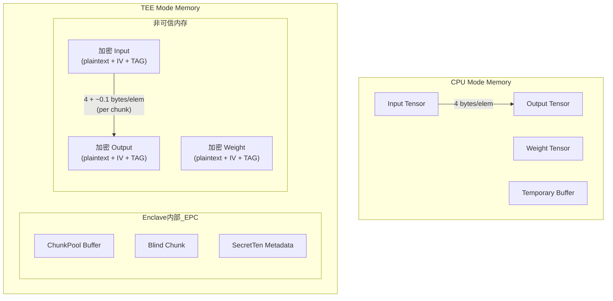
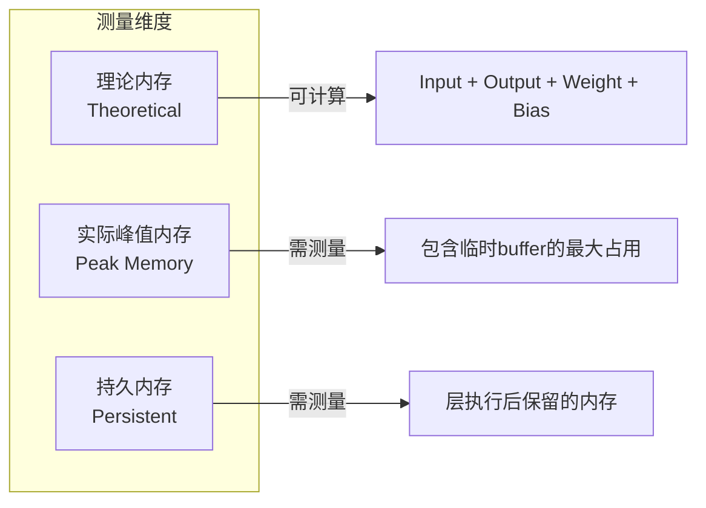

# Inception V3 每层内存占用分析方案

## 问题1分析：CPU vs TEE 内存占用是否相同

**结论：不同。TEE 模式的内存占用显著大于 CPU 模式。**

### 1.1 内存差异来源




### 1.2 具体差异计算

根据代码分析，TEE 模式的额外内存开销来自：| 开销类型 | 计算公式 | 说明 ||---------|----------|------|| **AES-GCM 加密元数据** | `IV(12B) + TAG(16B) = 28B/chunk` | 每个 STORE_CHUNK 一份 || **sgx_aes_gcm_data_t 结构** | `~32B/chunk` | 参见 [`common_utils.cpp:40`](App/common_utils.cpp) || **ChunkPool 预分配** | `THREAD_POOL_SIZE * 2 * STORE_CHUNK_ELEM * 4B` | ~30MB（enclave内） || **Blind Chunk Buffer** | `THREAD_POOL_SIZE * STORE_CHUNK_ELEM * 4B` | 解密时的临时buffer || **SecretTen 元数据** | `ChunkIds vector + unordered_map` | 每个tensor约100-200B |

### 1.3 单层内存对比示例（Conv层 stem_conv1）

以 `stem_conv1` 为例（输入: [1,3,299,299], 输出: [1,32,149,149]）:| 内存项 | CPU 模式 | TEE 模式 ||--------|----------|----------|| Input Tensor | 1.07 MB | 1.07 MB (加密存储) + 28B元数据/chunk || Output Tensor | 2.82 MB | 2.82 MB (加密存储) + 28B元数据/chunk || Weight (32x3x3x3) | 3.4 KB | 3.4 KB (加密存储) || **Enclave内 ChunkPool** | 0 | ~30 MB (共享) || **Blind Buffer** | 0 | ~15 MB (共享) || **总额外开销** | 0 | ~45+ MB (固定) + O(元数据) |---

## 问题2分析：如何合理测量内存占用

### 2.1 测量维度




### 2.2 推荐测量方案

**方案A：理论内存计算（精确，推荐首选）**直接根据 tensor shape 计算，无需运行时测量：

```python
def calc_layer_memory(layer):
    """计算单层理论内存占用"""
    bytes_per_elem = 4  # float32
    
    # Input tensor
    input_bytes = np.prod(input_shape) * bytes_per_elem
    
    # Output tensor  
    output_bytes = np.prod(output_shape) * bytes_per_elem
    
    # Weight + Bias (Conv/Linear/BatchNorm)
    weight_bytes = np.prod(weight_shape) * bytes_per_elem if has_weight else 0
    bias_bytes = np.prod(bias_shape) * bytes_per_elem if has_bias else 0
    
    # TEE额外开销（按chunk计算）
    num_chunks = ceil(total_elements / STORE_CHUNK_ELEM)
    encryption_overhead = num_chunks * (12 + 16 + 32)  # IV + TAG + struct
    
    return {
        'cpu_memory': input_bytes + output_bytes + weight_bytes + bias_bytes,
        'tee_tensor_memory': input_bytes + output_bytes + weight_bytes + bias_bytes,
        'tee_encryption_overhead': encryption_overhead,
        'tee_total': ...,  # 包含共享pool的摊销
    }
```

**方案B：运行时测量（TEE模式特有开销）**

```python
# 在 Enclave 内使用 EDMM 统计
def measure_tee_memory():
    # 1. 调用 OCALL 获取 EDMM 统计
    # 见 sgx_edmm_wrapper.h 中的 EdmmStats
    
    # 2. 或使用 /proc/self/statm 测量进程内存
    import resource
    before = resource.getrusage(resource.RUSAGE_SELF).ru_maxrss
    layer.forward()
    after = resource.getrusage(resource.RUSAGE_SELF).ru_maxrss
    peak_memory = after - before
```


### 2.3 扩展 profile_inception.py 的方案

在现有 `LayerMetrics` 类基础上添加内存字段：

```python
@dataclass
class LayerMetrics:
    # ... 现有字段 ...
    
    # 新增内存字段
    cpu_memory_bytes: int = 0        # CPU理论内存
    tee_memory_bytes: int = 0        # TEE理论内存  
    tee_overhead_bytes: int = 0      # TEE额外开销
    weight_bytes: int = 0            # 参数内存
    activation_bytes: int = 0        # 激活值内存
```

---

## 实现建议

### 阶段1：添加理论内存计算（无需运行）

修改 [`profile_inception.py`](experiments/models/profile_inception.py)，在 `LayerMetrics` 初始化时计算：

- 从 `input_shape`, `output_shape` 计算激活值内存
- 从层类型推断 weight/bias 大小
- 按 STORE_CHUNK_ELEM 计算 chunk 数量和加密开销

### 阶段2：添加运行时峰值测量（可选）