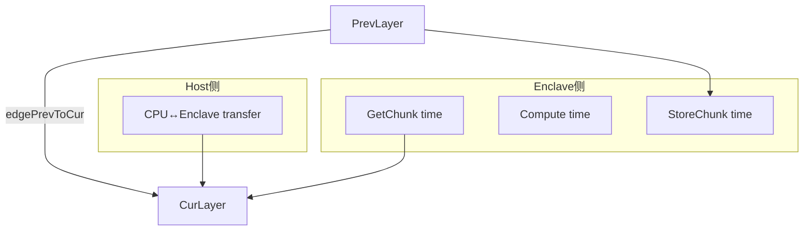

# ViT(TAOISM/SGX) 测时修复计划

## 目标与约束

- **目标**：让 [`experiments/models/profile_vit_enclave.py`](experiments/models/profile_vit_enclave.py) 输出的 ViT 层级时延具备一致语义：
- MatMul 的时延来自 **Enclave 实现**（不再用 CPU matmul 代替）。
- 每个算子（层）输出：**段总时延**（包含输入层 forward/搬运 + 算子 forward）与 **拆分后的“层间数据搬运时延”**（你已确认：搬运时延需要包含 Enclave 内 chunk paging 的 GetChunk/StoreChunk）。
- CSV 中必须能指出 **是哪两层之间**产生的数据搬运开销（MatMul 这种多输入要支持多条边）。
- **约束**：你选择了 MatMul 仍按“段计时”口径（`input.forward + matmul.forward`），但要拆出搬运并记录；搬运时延定义包含 Enclave 内 chunk paging。

## 现状关键发现（用于指导修复）

- **MatMul 已有 Enclave 实现链路**：
- Python 层：`python/layers/matmul.py`（`matmul_init/matmul_forward`）
- Enclave 导出：[`Enclave/Enclave.edl`](Enclave/Enclave.edl) + [`SGXDNN/sgxdnn_main.cpp`](SGXDNN/sgxdnn_main.cpp) + [`Enclave/sgxdnn.cpp`](Enclave/sgxdnn.cpp)
- SGXDNN 内核：[`SGXDNN/layers/matmul.cpp`](SGXDNN/layers/matmul.cpp)
- **Softmax/GELU/LayerNorm 也已接入 Enclave**：Python 层 `softmax.py/gelu.py/layer_norm.py` 已调用 `*_init` 和 `*_forward`；对应 EDL/ECALL/SGXDNN 内核也存在。
- **profile_vit_enclave.py 仍在 CPU 测 MatMul**：需要切换为 `_profile_matmul_enclave`。
- **计时边界问题**：当前 profiler 把输入层 forward（其中含 CPU↔Enclave 传输等）计入算子时延，且不同算子/模式语义不一致。
- **sgx_vit_native.py 存在 SGXLinearBase 构造参数不匹配**：`SGXLinearBase.__init__` 需要 `batch_size,n_output_features,n_input_features`，但文件中按 `n_output_channel=` 等错误参数传入，影响端到端链式执行与测量可靠性。

## 总体改造思路（拆分“段总时延 / 搬运 / 计算”）

我们把一次 layer forward 的“段总时延”拆为三类时间，并全部写入 CSV：

1. **Host侧搬运/桥接时延**：CPU↔Enclave 方向的 set/get/transfer（发生在 `forward_tensor_transfer()` 或输入层 set_input/transfer 之类的路径）。
2. **Enclave侧chunk搬运时延**：SGXDNN 内核中对 `TrustedChunkManager::GetChunk/StoreChunk` 的时间（你要求纳入“搬运时延”）。
3. **Enclave侧计算时延**：SGXDNN 内核中除去 Get/Store 的纯计算时间。

为满足“指出是哪两层之间”，我们把搬运时延按**边（prev -> cur）**来记录：

- 单输入层：边只有 `PrevLayer -> ThisLayer`。
- 双输入层（MatMul）：边有 `PrevLayer[0] -> MatMul` 与 `PrevLayer[1] -> MatMul` 两条。
- Enclave 内 chunk 搬运：
- 将 **PrevLayer 的 StoreChunk 时间** 与 **ThisLayer 的 GetChunk 时间** 都归到边 `PrevLayer -> ThisLayer`（对 MatMul 分别归到两条边）。

## 任务拆解（对应你提出的4点）

### 1) MatMul：从 CPU 测量切换为 Enclave 测量

- **文件**：[`experiments/models/profile_vit_enclave.py`](experiments/models/profile_vit_enclave.py)
- **改动**：
- 在 `_profile_block()` 中把两处 `_profile_matmul_cpu(...)` 替换为 `_profile_matmul_enclave(...)`：
    - `block*_attn_qk_matmul`：`transpose_b=True` 且 `scale=1/sqrt(head_dim)`（保持与你 ViT 设计一致）。
    - `block*_attn_v_matmul`：`transpose_b=False`。
- 输出 CSV 时 `execution_mode` 对 MatMul 应为 `Enclave`，`enclave_time_*` 需有值。
- **验证**：生成的 `vit_{variant}_enclave_layers.csv` 中 MatMul 行不再出现 enclave_time=0。

### 2) 计时边界修复：拆分并记录“层间搬运时延（含chunk paging）”

- **目标输出（CSV新增字段，建议）**：
- **段总时延**：继续复用现有 `enclave_time_mean/std/min/max/p95/p99`（含 input forward + layer forward）。
- **新增：搬运时延字段**（按边）
    - `xfer_edges_json`：JSON 字符串，形如：
    - 单输入：`{"prev->cur": {"host_ms":..., "enclave_get_ms":..., "enclave_store_ms":..., "total_ms":...}}`
    - MatMul：包含两条边：`prev1->matmul`、`prev2->matmul`。
    - `xfer_total_mean_ms`：把该 layer 所有入边的搬运时延（host + enclave chunk）求和后的均值，方便快速汇总。
- **新增：计算时延字段（可选但强烈建议）**
    - `compute_mean_ms`：用于分布式模拟里“纯计算”部分（避免把搬运重复计入通信模型）。
- **实现方案（两层）**：

1. **Host侧搬运计时**（Python）

    - **文件**：[`python/layers/base.py`](python/layers/base.py)
    - **改动**：在 `forward_tensor_transfer()` 的每个分支（CPU→Enclave、Enclave→CPU、GPU→CPU、CPU→GPU 等）外层增加 `NamedTimerInstance`，并把 timer name 规范化为可解析格式，包含：
    - `from=<PrevLayerName>`、`to=<ThisLayerName>`、`dir=cpu_to_enclave/enclave_to_cpu/...`、`tensor=input/input1/input2`。
    - **profiler侧**：每次 iteration 结束后从 `NamedTimer.get_instance().timers` 抽取本 iteration 的 transfer timer，聚合成边级统计。

2. **Enclave侧 chunk paging 拆分计时**（C++/SGXDNN）

    - **文件**：
    - [`SGXDNN/layers/gelu.cpp`](SGXDNN/layers/gelu.cpp)
    - [`SGXDNN/layers/layernorm.cpp`](SGXDNN/layers/layernorm.cpp)
    - [`SGXDNN/layers/softmax.cpp`](SGXDNN/layers/softmax.cpp)
    - [`SGXDNN/layers/matmul.cpp`](SGXDNN/layers/matmul.cpp)
    - **改动**：在每个 `forward()` 内将时间拆成：
    - `t_get_chunk_ms`（累计 GetChunk 调用时间）
    - `t_compute_ms`（计算循环/softmax/gelu/matmul本体）
    - `t_store_chunk_ms`（累计 StoreChunk 调用时间）
    - **统计存储**：以 `FunId` 为 key，维护一份 enclave 内的 `LayerRuntimeStats`（最后一次 forward 或累加/平均）。
    - **新增接口**：
    - [`Enclave/Enclave.edl`](Enclave/Enclave.edl) 新增 `ecall_get_layer_runtime_stats(uint64_t FunId, [out] Stats* out)` 或等价接口。
    - [`SGXDNN/sgxdnn_main.cpp`](SGXDNN/sgxdnn_main.cpp) + [`Enclave/sgxdnn.cpp`](Enclave/sgxdnn.cpp) 增加对应 ecall 实现。
    - [`python/enclave_interfaces.py`](python/enclave_interfaces.py) 增加 Python 侧 wrapper，profiler 在每次 `*_forward(FunId)` 后拉取 stats。
    - **边归因策略**：
    - 对于单输入层：把 `cur.get_chunk_ms` + `prev.store_chunk_ms` 归入 `prev->cur`。
    - 对于 MatMul：把 `get_chunk_ms` 按 input1/input2 分开计（需要在 matmul.cpp 把 A/B 两次 GetChunk 分别计时），分别归入 `prev1->matmul` 与 `prev2->matmul`。
- **验证**：
- CSV 每行都有 `xfer_edges_json`；MatMul 行里包含两条边。
- 端到端合成时：`segment_total ≈ xfer_total + compute_total`（允许有微小误差）。

### 3) 修复 `sgx_vit_native.py` 中 `SGXLinearBase` 参数不匹配

- **文件**：[`experiments/models/sgx_vit_native.py`](experiments/models/sgx_vit_native.py)
- **问题根因**：`SGXLinearBase.__init__(sid,LayerName,EnclaveMode,batch_size,n_output_features,n_input_features,...)` 必填 `batch_size`，而当前代码按 `n_output_channel=` 等错误参数传入。
- **修复策略**：
- 全面替换 `SGXLinearBase(... n_output_channel=...)` 为正确入参：
    - 对形如 `(B,N,D)->(B,N,3D)` 的 Linear：在 native 实现里建议**显式flatten**为 `(B*N, D)`，因此 `batch_size=B*N`，`n_input_features=D`，`n_output_features=3D`。
    - 对 `(B,N,D)->(B,N,D)` 的 out_proj：同理 `batch_size=B*N`。
    - 对分类头 `(B,D)->(B,C)`：`batch_size=B`。
- 同步检查 `SecretLayerNormLayer` 的 `InputShape`（2D flatten 时它会把 batch_size=1, seq_len=InputShape[0] 的假设写入 init，这可能与你的 flatten 策略冲突）。建议在 native 路径中：
    - 要么统一维持 3D `[B,N,D]` 给 LayerNorm；
    - 要么明确给 LayerNorm 增加 `batch_size/seq_len` 参数（或在 init_shape 中保存原始 `(B,N)` 信息）。
- **验证**：增加一个最小端到端链式执行脚本（或现有测试）确保 `SGXViTBase` 可以从 input 一直 forward 到 output（至少 CPU 模式，Enclave 模式按环境具备时再测）。

### 4) 新增 SGXDNN 算子是否被正常调用、以及实现风险点分析与修复

#### 4.1 调用链核查结论（当前已接入）

- **链路已完整**：
- `python/layers/{layer_norm,softmax,gelu,matmul}.py` 调用 `EnclaveInterface.{layernorm,softmax,gelu,matmul}_init/forward`。
- `python/enclave_interfaces.py` 已绑定 `InitLayernorm/LayernormForward/InitSoftmax/SoftmaxForward/InitGELU/GELUForward/InitMatMul/MatMulForward`。
- `Enclave/Enclave.edl` 与 `SGXDNN/sgxdnn_main.cpp` 与 `Enclave/sgxdnn.cpp` 均已声明并实现对应 `ecall_*`。
- `SGXDNN/sgxdnn_main.cpp` 已 include `layers/layernorm.hpp/softmax.hpp/gelu.hpp/matmul.hpp`。

#### 4.2 实现风险点（需要在修复中一并加固）

- **(A) softmax/layernorm 的 rows_per_chunk/tokens_per_chunk 可能为0**：当 `STORE_CHUNK_ELEM < softmax_dim` 或 `< embed_dim` 时会出现步长为0导致死循环。
- 修复：在 SGXDNN 侧 `forward()` 中增加 guard：若 `rows_per_chunk==0`（或 tokens_per_chunk==0）则直接报错或强制 `rows_per_chunk=1` 并调整每次处理量。
- **(B) matmul.cpp 当前按“整矩阵/每头”加载到一个 chunk**：
- 若未来扩大 seq_len（更大分辨率/patch更小）或 STORE_CHUNK_ELEM 设置偏小，可能溢出。
- 修复（分两步）：
    - 先加硬性校验：`max(size_A,size_B,size_C) <= STORE_CHUNK_ELEM`，不满足则显式报错（避免 silent overflow）。
    - 需要通用性时再做 tiled matmul（按 K 维或 N 维分块），并将每个 tile 的 Get/Store 计入 enclave 搬运时间。
- **(C) softmax/gelu 使用 `exp/tanh/erf` 的数值与性能**：
- 对性能测量没问题，但对数值稳定/一致性建议在测试中对比 CPU 结果误差阈值。
- **(D) 目前 Python 层注释仍写“暂用CPU until native available”**：实际已走 enclave forward，建议同步注释，避免误解。

#### 4.3 算子被调用的验证方法（不改环境也能验证）

- 在 Python profiler 中增加一个 `--debug-op-call` 开关（或用现有日志）：
- 在每次 `*_init` 后打印一次 `FunId/layer_name`。
- 在 `*_forward` 前后打印一次，并在 Enclave 侧 stats 接口返回非零 `get/store/compute`，作为“确实走到 SGXDNN 内核”的证据。

## 交付物

- 更新后的 `vit_{variant}_enclave_layers.csv/json`：
- MatMul 行 `execution_mode=Enclave` 且有 enclave_time。
- 新增字段 `xfer_edges_json`（明确 prev->cur），以及汇总字段（`xfer_total_mean_ms`、`compute_mean_ms`）。
- 端到端可运行的 `sgx_vit_native.py`（至少 CPU 模式能链式 forward；Enclave 模式在环境满足时可跑）。
- SGXDNN 新算子：增加 chunk/compute 拆分计时与防御性检查。