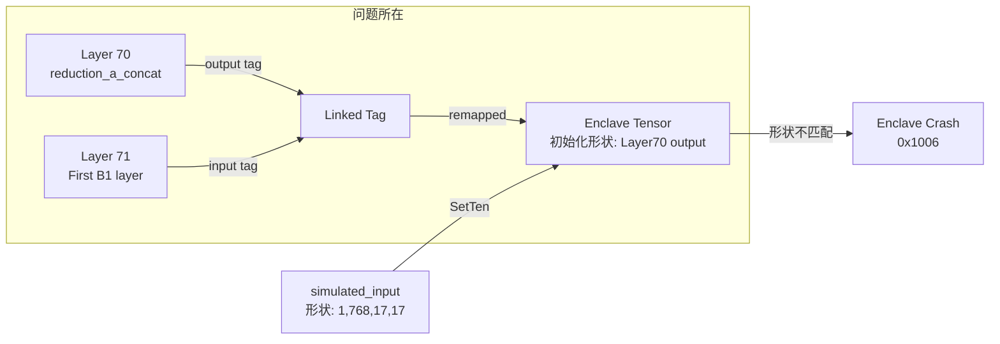

# 修复 Inception-B1 SetTen Enclave 崩溃

## 问题诊断

### 错误码含义

- `0x1006` = `SGX_ERROR_ENCLAVE_CRASHED` - **Enclave 崩溃**（不是内存不足或参数错误）

### 根本原因

在 [`profile_inception.py`](experiments/models/profile_inception.py) 第 1387-1393 行：

```python
if first_group_layer_idx > 0:
    # ...
    first_layer.set_cpu("input", simulated_input)
    if hasattr(first_layer, 'transfer_cpu_to_enclave'):
        first_layer.transfer_cpu_to_enclave("input")
```

问题链条：

1. **Tensor Tag 链接**：模型初始化时，`SecretNeuralNetwork.set_layers()` 调用 `link_tensors()` 将每层的 "input" tag 链接到前一层的 "output" tag
2. **Tag 重映射**：Inception-B1 第一层（索引 71）的 "input" tag 被重映射到第 70 层（`reduction_a_concat`）的 "output" tag
3. **Tensor 初始化不匹配**：该共享 tag 的 enclave tensor 是按照 `reduction_a_concat` 的输出形状初始化的
4. **崩溃触发**：`transfer_cpu_to_enclave("input")` 尝试使用重映射的 tag 调用 `SetTen`，但我们传入的 `simulated_input` 形状可能与已初始化的 tensor 不匹配，导致 Enclave 内部内存访问错误

### 数据流示意




## 修复方案

修改 [`profile_inception.py`](experiments/models/profile_inception.py) 第 1387-1397 行的逻辑：**方案**：不要使用 `transfer_cpu_to_enclave("input")`，而是直接在第一个组层上使用独立的 tensor 设置方式，绕过 tag 链接机制。

### 具体修改

在第 1387 行附近，将：

```python
if first_group_layer_idx > 0:
    print(f"   Skipping {first_group_layer_idx} predecessor layers (direct input injection)")
    simulated_input_shape = config['input_shape'].copy()
    simulated_input_shape[0] = batch_size
    simulated_input = torch.randn(*simulated_input_shape)
    print(f"   Simulated input shape: {simulated_input_shape}")
    
    first_layer = group_layers[0]
    if hasattr(first_layer, 'set_cpu'):
        first_layer.set_cpu("input", simulated_input)
        if hasattr(first_layer, 'transfer_cpu_to_enclave'):
            first_layer.transfer_cpu_to_enclave("input")
        print(f"   ✓ Injected simulated input to {first_layer.LayerName}")
```

修改为：

```python
if first_group_layer_idx > 0:
    print(f"   Skipping {first_group_layer_idx} predecessor layers (direct input injection)")
    simulated_input_shape = config['input_shape'].copy()
    simulated_input_shape[0] = batch_size
    simulated_input = torch.randn(*simulated_input_shape)
    print(f"   Simulated input shape: {simulated_input_shape}")
    
    first_layer = group_layers[0]
    # 方法1: 只设置 CPU tensor，让 forward() 处理数据传输
    # 不使用 transfer_cpu_to_enclave，因为 tag 链接会导致问题
    first_layer.set_cpu("input", simulated_input)
    
    # 方法2 (可选): 如果需要立即传输到 Enclave，使用 init + set 绕过链接
    # 获取未重映射的 tag
    input_tag = first_layer.get_tag("input", remap=False)
    # 初始化独立的 enclave tensor（如果尚未初始化）
    from python.enclave_interfaces import GlobalTensor
    if input_tag not in GlobalTensor.IsInitEnclaveTensor:
        GlobalTensor.init_enclave_tensor(input_tag, simulated_input_shape)
    # 直接设置 tensor（绕过重映射）
    GlobalTensor.EnclaveInterface.set_tensor_unsafe(input_tag, simulated_input)
    
    print(f"   ✓ Injected simulated input to {first_layer.LayerName}")
```


## 注意事项