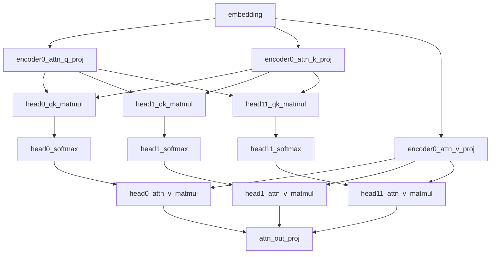

# BERT Per-Head Attention 依赖关系说明

## 问题描述

在使用 per-head profiling 时，之前的实现错误地将依赖关系设置为顺序执行：

```
head0_qk_matmul → head0_softmax → head0_attn_v → 
  head1_qk_matmul → head1_softmax → head1_attn_v → 
    head2_qk_matmul → ...
```

这是**错误的**！多个注意力头应该是**并行**计算的。

## 正确的依赖关系

### 整体架构

```
Previous Block Output (encoder{i-1}_norm2 or embedding)
         ↓
    ┌────┴─────┬─────┬─────┐
    ↓          ↓     ↓     ↓
 Q_proj    K_proj  V_proj (并行)
    ↓          ↓     ↓
    └────┬─────┴─────┘
         ↓
    ┌────┴────┬────┬────┐
    ↓         ↓    ↓    ↓
  Head0    Head1  ...  Head11 (并行！)
    ↓         ↓    ↓    ↓
    └────┬────┴────┴────┘
         ↓
    Out_proj
         ↓
      Norm1
         ↓
      FFN...
         ↓
      Norm2
```

### Per-Head 模式详细依赖

#### 1. Embedding Layer
```python
layer: 'embedding'
dependencies: []  # 第一层，无依赖
```

#### 2. Encoder Block - Q/K/V Projections
```python
# 所有三个投影并行执行，都依赖于前一个 block 的输出
layer: 'encoder0_attn_q_proj'
dependencies: ['embedding']  # 或 encoder{i-1}_norm2

layer: 'encoder0_attn_k_proj'
dependencies: ['embedding']

layer: 'encoder0_attn_v_proj'
dependencies: ['embedding']
```

#### 3. 多头并行计算

**关键**：每个头的计算**相互独立**，可以并行执行！

##### Head 0:
```python
layer: 'encoder0_attn_head0_qk_matmul'
dependencies: ['encoder0_attn_q_proj', 'encoder0_attn_k_proj']

layer: 'encoder0_attn_head0_softmax'
dependencies: ['encoder0_attn_head0_qk_matmul']

layer: 'encoder0_attn_head0_attn_v_matmul'
dependencies: ['encoder0_attn_head0_softmax', 'encoder0_attn_v_proj']
```

##### Head 1:
```python
layer: 'encoder0_attn_head1_qk_matmul'
dependencies: ['encoder0_attn_q_proj', 'encoder0_attn_k_proj']  # 与 Head 0 相同！

layer: 'encoder0_attn_head1_softmax'
dependencies: ['encoder0_attn_head1_qk_matmul']  # 只依赖自己的 qk

layer: 'encoder0_attn_head1_attn_v_matmul'
dependencies: ['encoder0_attn_head1_softmax', 'encoder0_attn_v_proj']
```

##### Head 2-11:
同样的模式，每个头**并行**计算。

#### 4. Output Projection
```python
layer: 'encoder0_attn_out_proj'
dependencies: [
    'encoder0_attn_head0_attn_v_matmul',
    'encoder0_attn_head1_attn_v_matmul',
    'encoder0_attn_head2_attn_v_matmul',
    ...,
    'encoder0_attn_head11_attn_v_matmul'
]  # 依赖所有头的输出（拼接后投影）
```

#### 5. FFN 部分（顺序执行）
```python
layer: 'encoder0_norm1'
dependencies: ['encoder0_attn_out_proj']

layer: 'encoder0_ffn_fc1'
dependencies: ['encoder0_norm1']

layer: 'encoder0_ffn_gelu'
dependencies: ['encoder0_ffn_fc1']

layer: 'encoder0_ffn_fc2'
dependencies: ['encoder0_ffn_gelu']

layer: 'encoder0_norm2'
dependencies: ['encoder0_ffn_fc2']
```

#### 6. Classifier Head
```python
layer: 'pooler'
dependencies: ['encoder11_norm2']  # 最后一个 encoder 的输出

layer: 'classifier'
dependencies: ['pooler']
```

## 批量模式依赖关系

批量模式下，所有头一起计算：

```python
layer: 'encoder0_attn_qk_matmul'
dependencies: ['encoder0_attn_q_proj', 'encoder0_attn_k_proj']

layer: 'encoder0_attn_softmax'
dependencies: ['encoder0_attn_qk_matmul']

layer: 'encoder0_attn_v_matmul'
dependencies: ['encoder0_attn_softmax', 'encoder0_attn_v_proj']

layer: 'encoder0_attn_out_proj'
dependencies: ['encoder0_attn_v_matmul']
```

## 对比：错误 vs 正确

### ❌ 错误的依赖关系（修复前）

```
encoder0_attn_head0_attn_v_matmul
    ↓ (错误！)
encoder0_attn_head1_qk_matmul
    ↓
encoder0_attn_head1_softmax
    ↓
encoder0_attn_head1_attn_v_matmul
    ↓ (错误！)
encoder0_attn_head2_qk_matmul
    ...
```

**问题**：暗示头之间有顺序依赖，必须串行执行。

### ✅ 正确的依赖关系（修复后）

```
                Q_proj ──┬─────┬─────┐
                K_proj ──┤     │     │
                         ↓     ↓     ↓
                      Head0  Head1  Head11
                         ↓     ↓     ↓
                         └──┬──┴──┬──┘
                            ↓     ↓
                        Out_proj
```

**好处**：明确显示头之间可以并行执行！

## DAG 可视化

### Per-Head 模式的真实 DAG



## 并行度分析

### 理论最大并行度

在 per-head 模式下，理论上可以同时执行的层数：

#### 阶段 1：Q/K/V 投影
- **并行度 = 3**（Q、K、V 同时计算）

#### 阶段 2：多头注意力
- **并行度 = 12**（BERT-base 的 12 个头同时计算）
- 每个头内部有 3 个操作：QK → Softmax → Attn@V

#### 阶段 3：Output 投影
- **并行度 = 1**（等待所有头完成）

#### 阶段 4：FFN
- **并行度 = 1**（顺序执行）

### 关键路径分析

**Critical Path**（最长路径）：
```
embedding → Q_proj → head_X_qk → head_X_softmax → head_X_attn_v → out_proj → norm1 → fc1 → gelu → fc2 → norm2
```

对于任何一个头 X，路径长度相同，因此：
- 所有头并行执行不会增加总延迟
- 顺序执行则会增加 12 倍延迟（错误！）

## 修复验证

### 验证方法

运行 profiling 后检查 CSV 文件：

```bash
# 检查 Head 1 的 qk_matmul 依赖
grep 'encoder0_attn_head1_qk_matmul' bert_base_enclave_per_head_layers.csv

# 应该看到：
# dependencies: "['encoder0_attn_q_proj', 'encoder0_attn_k_proj']"
# 而不是：['encoder0_attn_head0_attn_v_matmul']
```

### Python 验证脚本

```python
import pandas as pd

df = pd.read_csv('experiments/data/bert_base_enclave_per_head_layers.csv')

# 检查所有头的 qk_matmul 依赖
qk_layers = df[df['name'].str.contains('head\d+_qk_matmul')]

for idx, row in qk_layers.iterrows():
    deps = eval(row['dependencies'])
    expected = [
        row['name'].replace('head', 'attn').split('_head')[0] + '_q_proj',
        row['name'].replace('head', 'attn').split('_head')[0] + '_k_proj'
    ]
    
    if set(deps) != set(expected):
        print(f"❌ {row['name']}: 依赖错误")
        print(f"   期望: {expected}")
        print(f"   实际: {deps}")
    else:
        print(f"✓ {row['name']}: 依赖正确")

# 检查 out_proj 依赖
out_proj = df[df['name'].str.match('encoder0_attn_out_proj')].iloc[0]
deps = eval(out_proj['dependencies'])
print(f"\nout_proj dependencies count: {len(deps)}")
print(f"Expected: 12 (all heads)")
print(f"Actual: {deps[:3]}... (showing first 3)")
```

## 性能影响

### 修复前（错误依赖）
- **关键路径长度**：O(num_heads × 3) per encoder
- **暗示执行模式**：串行
- **调度器行为**：可能强制顺序执行各个头

### 修复后（正确依赖）
- **关键路径长度**：O(3) per encoder（与头数无关）
- **明确并行性**：所有头可以并行
- **调度器行为**：可以充分利用并行性

## 实现细节

### 修改的函数签名

所有 `_profile_*_enclave` 函数添加了 `dependencies` 参数：

```python
def _profile_linear_enclave(
    self, name: str, input_shape: List[int], 
    output_features: int, group: str, verbose: bool,
    dependencies: Optional[List[str]] = None  # 新增参数
):
    # ...
    if dependencies is None:
        dependencies = infer_layer_dependencies(name, ...)  # 后备方案
    # ...
```

### 调用示例

```python
# Q/K/V 投影：所有依赖前一层
self._profile_linear_enclave(
    f'{prefix}_attn_q_proj', ...,
    dependencies=['embedding']  # 或 encoder{i-1}_norm2
)

# 每个头的 QK matmul：依赖 Q 和 K 投影
self._profile_matmul_enclave(
    f'{prefix}_attn_head{i}_qk_matmul', ...,
    dependencies=[f'{prefix}_attn_q_proj', f'{prefix}_attn_k_proj']
)

# Out projection：依赖所有头的输出
self._profile_linear_enclave(
    f'{prefix}_attn_out_proj', ...,
    dependencies=[
        f'{prefix}_attn_head0_attn_v_matmul',
        ...
        f'{prefix}_attn_head11_attn_v_matmul'
    ]
)
```

## 残差连接的处理

在 Transformer 中，实际上有残差连接：

```
x = norm(x + attention(x))
x = norm(x + ffn(x))
```

这意味着：
- `norm1` 依赖于 `attn_out_proj` **和** `prev_block_output`
- `norm2` 依赖于 `ffn_fc2` **和** `norm1`

**简化处理**：
为了简化，我们只标记主路径的依赖，残差连接的依赖在实际调度时需要考虑。

完整的依赖应该是：
```python
layer: 'encoder0_norm1'
dependencies: ['encoder0_attn_out_proj', 'embedding']  # 残差连接

layer: 'encoder0_norm2'
dependencies: ['encoder0_ffn_fc2', 'encoder0_norm1']  # 残差连接
```

但在当前实现中，我们只标记了主路径，这对于理解计算流程已经足够。

## 测试和验证

### 快速检查

```bash
# 重新运行 profiling
LD_PRELOAD=/usr/lib/x86_64-linux-gnu/libstdc++.so.6 \
python -m experiments.models.profile_bert_enclave \
    --model mini \
    --per-head \
    --iterations 5

# 检查依赖关系
python experiments/models/verify_dependencies.py
```

### 预期结果

所有 `headX_qk_matmul` 层应该有相同的依赖：`[q_proj, k_proj]`

所有 `headX_softmax` 层应该只依赖自己的 `qk_matmul`

`out_proj` 应该依赖所有 12 个头的 `attn_v_matmul`

---

**修复日期**：2026-01-20
**影响范围**：Per-head profiling 模式的依赖关系生成
**性能影响**：正确反映并行性，有助于调度优化
