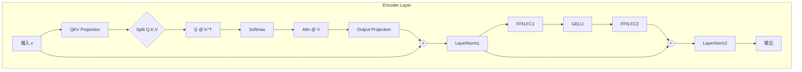
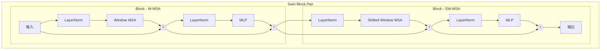
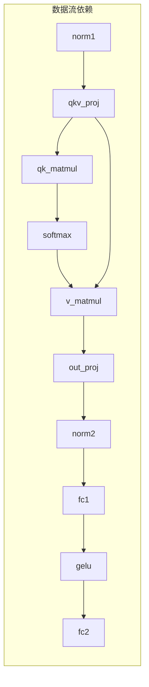

# Transformer 模型网络结构与层间依赖分析

本文档详细介绍 TAOISM 项目中支持的六个 Transformer 模型的网络结构、拓扑关系，并分析当前依赖推断机制的准确性和局限性。

## 目录

- [概述](#概述)
- [模型网络结构](#模型网络结构)
  - [ViT (Vision Transformer)](#1-vit-vision-transformer)
  - [BERT](#2-bert)
  - [DistilBERT](#3-distilbert)
  - [TinyBERT](#4-tinybert)
  - [ALBERT](#5-albert)
  - [Swin Transformer](#6-swin-transformer)
- [层间依赖关系分析](#层间依赖关系分析)
- [当前推断机制分析](#当前推断机制分析)
- [验证结果](#验证结果)

---

## 概述

### 模型分类

| 类别 | 模型 | 输入类型 | 主要应用 |
|------|------|----------|----------|
| **视觉 Transformer** | ViT | 图像 (224×224) | 图像分类 |
| **视觉 Transformer** | Swin | 图像 (224×224) | 图像分类、目标检测 |
| **NLP Transformer** | BERT | 文本序列 | 自然语言理解 |
| **NLP Transformer** | DistilBERT | 文本序列 | 轻量级 NLU |
| **NLP Transformer** | TinyBERT | 文本序列 | 移动端 NLU |
| **NLP Transformer** | ALBERT | 文本序列 | 参数高效 NLU |

### 依赖分析的重要性

层间依赖关系对于以下场景至关重要：

1. **并行推理优化**：识别可并行执行的独立操作
2. **分布式部署**：确定层在 TEE/CPU 间的最优分配
3. **流水线调度**：构建高效的推理流水线
4. **内存规划**：确定张量的生命周期和复用机会

---

## 模型网络结构

### 1. ViT (Vision Transformer)

**论文**: "An Image is Worth 16x16 Words" (ICLR 2021)

#### 整体架构

```
输入图像 (B, 3, 224, 224)
    │
    ▼
┌─────────────────┐
│  Patch Embed    │  Conv2d: 3 → embed_dim, kernel=16, stride=16
│  + CLS Token    │  输出: (B, 197, embed_dim)
│  + Pos Embed    │
└────────┬────────┘
         │
         ▼
┌─────────────────┐
│ Transformer     │
│ Block × N       │  N = 12 (Base/Small/Tiny)
└────────┬────────┘
         │
         ▼
┌─────────────────┐
│  Head LayerNorm │
│  + Classifier   │  Linear: embed_dim → num_classes
└────────┬────────┘
         │
         ▼
    输出 logits
```

#### Transformer Block 内部结构 (Pre-LN)

```mermaid
graph TD
    subgraph block [Transformer Block]
        Input[输入 x] --> LN1[LayerNorm1]
        LN1 --> QKV[QKV Projection]
        QKV --> Split{Split Q,K,V}
        Split --> QK[Q @ K^T]
        QK --> Scale[/ sqrt_d_k]
        Scale --> Softmax[Softmax]
        Softmax --> AV[Attn @ V]
        AV --> OutProj[Output Projection]
        OutProj --> Add1((+))
        Input --> Add1
        Add1 --> LN2[LayerNorm2]
        LN2 --> FC1[FFN.FC1]
        FC1 --> GELU[GELU]
        GELU --> FC2[FFN.FC2]
        FC2 --> Add2((+))
        Add1 --> Add2
        Add2 --> Output[输出]
    end
```

#### 参数配置

| 变体 | embed_dim | num_heads | num_layers | MLP hidden | 参数量 |
|------|-----------|-----------|------------|------------|--------|
| Tiny | 192 | 3 | 12 | 768 | ~5.7M |
| Small | 384 | 6 | 12 | 1536 | ~22M |
| Base | 768 | 12 | 12 | 3072 | ~86M |

#### 层命名约定

```
patch_embed                    # Patch Embedding (Conv2d)
block{i}_norm1                 # Pre-LayerNorm for Attention
block{i}_attn_qkv_proj         # QKV Projection (Linear)
block{i}_attn_qk_matmul        # Q @ K^T (MatMul)
block{i}_attn_softmax          # Softmax
block{i}_attn_v_matmul         # Attn @ V (MatMul)
block{i}_attn_out_proj         # Output Projection (Linear)
block{i}_norm2                 # Pre-LayerNorm for FFN
block{i}_ffn_fc1               # FFN First Layer (Linear)
block{i}_ffn_gelu              # GELU Activation
block{i}_ffn_fc2               # FFN Second Layer (Linear)
head_norm                      # Final LayerNorm
classifier                     # Classification Head (Linear)
```

---

### 2. BERT

**论文**: "BERT: Pre-training of Deep Bidirectional Transformers" (NAACL 2019)

#### 整体架构

```
输入 Token IDs (B, seq_len)
    │
    ▼
┌─────────────────┐
│  Embedding      │  Token + Position + Segment
│  Layer          │  输出: (B, seq_len, hidden_size)
└────────┬────────┘
         │
         ▼
┌─────────────────┐
│ Encoder Layer   │
│ × 12            │  12 层 Transformer Encoder
└────────┬────────┘
         │
         ▼
┌─────────────────┐
│  Pooler         │  取 [CLS] token → Linear → Tanh
└────────┬────────┘
         │
         ▼
    输出 (B, hidden_size)
```

#### Encoder Layer 结构 (Post-LN)



#### ViT vs BERT 的关键差异

| 特性 | ViT | BERT |
|------|-----|------|
| LayerNorm 位置 | Pre-LN (在 Attention/FFN 之前) | Post-LN (在残差加法之后) |
| 输入类型 | 图像 Patch | Token Embedding |
| 位置编码 | 可学习位置嵌入 | 可学习位置嵌入 |
| 第一层 | Conv2d Patch Embed | Token + Pos + Segment Embedding |

#### 参数配置 (BERT-Base)

| 参数 | 值 |
|------|-----|
| hidden_size | 768 |
| num_heads | 12 |
| num_layers | 12 |
| intermediate_size | 3072 |
| vocab_size | 30522 |
| max_position | 512 |

---

### 3. DistilBERT

**论文**: "DistilBERT, a distilled version of BERT" (NeurIPS 2019 Workshop)

#### 与 BERT 的关系

DistilBERT 是 BERT 的知识蒸馏版本，保留了 BERT 97% 的语言理解能力，同时：
- **层数减半**: 12 → 6 层
- **移除 Token Type Embedding**: 简化输入
- **参数减少 40%**: ~66M → ~40M

#### 架构差异

```
BERT:                          DistilBERT:
┌────────────────┐             ┌────────────────┐
│ Encoder × 12   │     →       │ Encoder × 6    │
└────────────────┘             └────────────────┘
│                              │
│ Token + Pos +                │ Token + Pos
│ Segment Embed                │ Embed (无 Segment)
```

#### 层命名约定

与 BERT 相同，但只有 `block0` 到 `block5`。

---

### 4. TinyBERT

**论文**: "TinyBERT: Distilling BERT for Natural Language Understanding" (EMNLP 2020)

#### 知识蒸馏架构

TinyBERT 采用两阶段蒸馏：
1. **通用蒸馏**: 从预训练 BERT 学习
2. **任务蒸馏**: 针对下游任务微调

#### 参数配置 (4-layer-312-hidden)

| 参数 | TinyBERT | BERT-Base |
|------|----------|-----------|
| num_layers | 4 | 12 |
| hidden_size | 312 | 768 |
| num_heads | 12 | 12 |
| intermediate_size | 1200 | 3072 |
| 参数量 | ~14.5M | ~110M |

#### 架构特点

- 隐藏层维度更小 (312 vs 768)
- 层数更少 (4 vs 12)
- 每层结构与 BERT 相同
- **拓扑依赖关系与 BERT 完全一致**

---

### 5. ALBERT

**论文**: "ALBERT: A Lite BERT for Self-supervised Learning" (ICLR 2020)

#### 创新点

1. **跨层参数共享**: 所有 Transformer 层共享同一组参数
2. **因子化嵌入参数化**: 将嵌入矩阵分解为两个小矩阵

#### 参数共享机制

```
传统 BERT:                     ALBERT:
┌─────────────┐                ┌─────────────┐
│ Layer 0     │ ← Params_0     │ Layer 0     │ ← ─┐
├─────────────┤                ├─────────────┤    │
│ Layer 1     │ ← Params_1     │ Layer 1     │ ← ─┼─ 共享参数
├─────────────┤                ├─────────────┤    │
│ ...         │                │ ...         │    │
├─────────────┤                ├─────────────┤    │
│ Layer 11    │ ← Params_11    │ Layer 11    │ ← ─┘
└─────────────┘                └─────────────┘
```

#### 因子化嵌入

```
传统 BERT:  V × H  (30522 × 768 = 23.4M)

ALBERT:     V × E + E × H  
            (30522 × 128) + (128 × 768) = 4.0M
```

#### 对依赖分析的影响

- **拓扑结构不变**: 层间数据流与 BERT 相同
- **参数共享透明**: 依赖分析只关注数据流，不受参数共享影响
- **依赖推断完全适用**

---

### 6. Swin Transformer

**论文**: "Swin Transformer: Hierarchical Vision Transformer using Shifted Windows" (ICCV 2021)

#### 整体架构

```
输入图像 (B, 3, 224, 224)
    │
    ▼
┌─────────────────┐
│  Patch Embed    │  Conv2d: 3 → C, kernel=4, stride=4
│                 │  输出: (B, 56×56, C)
└────────┬────────┘
         │
    ┌────┴────┐
    │ Stage 1 │  2 × Swin Block, 分辨率 56×56
    └────┬────┘
         │
    Patch Merging (下采样 2×)
         │
    ┌────┴────┐
    │ Stage 2 │  2 × Swin Block, 分辨率 28×28
    └────┬────┘
         │
    Patch Merging
         │
    ┌────┴────┐
    │ Stage 3 │  6 × Swin Block, 分辨率 14×14
    └────┬────┘
         │
    Patch Merging
         │
    ┌────┴────┐
    │ Stage 4 │  2 × Swin Block, 分辨率 7×7
    └────┬────┘
         │
    ▼
┌─────────────────┐
│  Head LayerNorm │
│  + Classifier   │
└─────────────────┘
```

#### Shifted Window Attention

```
Window Partition:              Shifted Window:
┌───┬───┬───┬───┐             ┌─┬───┬───┬─┐
│ 0 │ 1 │ 2 │ 3 │             │ │ 0 │ 1 │ │
├───┼───┼───┼───┤      →      ├─┼───┼───┼─┤
│ 4 │ 5 │ 6 │ 7 │             │ │ 2 │ 3 │ │
└───┴───┴───┴───┘             └─┴───┴───┴─┘
                              (偏移 window_size/2)
```

#### Swin Block 结构



#### 与 ViT 的关键差异

| 特性 | ViT | Swin |
|------|-----|------|
| 注意力范围 | 全局 (all tokens) | 局部窗口 (window_size × window_size) |
| 分辨率 | 固定 (14×14) | 层次化 (56→28→14→7) |
| 下采样 | 无 | Patch Merging |
| 复杂度 | O(N²) | O(N × M) where M = window_size² |

#### 层命名约定

```
patch_embed                         # Stage 0: Patch Embedding
stage0_block0_norm1                 # Stage 1, Block 0
stage0_block0_attn_qkv_proj
...
stage0_patch_merging                # Stage 1 → Stage 2 下采样
stage1_block0_norm1                 # Stage 2, Block 0
...
```

---

## 层间依赖关系分析

### 标准 Transformer Block 数据流



### 依赖类型分析

| 依赖类型 | 描述 | 示例 |
|----------|------|------|
| **串行依赖** | A 必须在 B 之前完成 | `norm1 → qkv_proj` |
| **分支汇合** | 多个输入合并 | `softmax + qkv → v_matmul` |
| **跨 Block 依赖** | Block 间串行 | `block0_ffn_fc2 → block1_norm1` |
| **残差连接** | 跳跃连接（当前未显式追踪） | `norm1 → add` |

### 可并行操作识别

基于依赖图，以下操作可以并行：

1. **不同 Head 的 Attention**: 如果使用 Head 并行
2. **独立 Block 的预取**: 在 Block i 计算时预取 Block i+1 的权重
3. **FFN 的两个分支**: 在某些变体中 FFN 可以分解

---

## 当前推断机制分析

### `infer_layer_dependencies` 函数工作原理

```python
def infer_layer_dependencies(layer_name, all_layer_names) -> List[str]:
    """
    1. 解析层名称提取 block 前缀、索引、组件名
    2. 根据 COMPONENT_DEPENDENCY_MAP 查找组件依赖
    3. 构建完整依赖层名称
    4. 处理特殊层 (patch_embed, head_norm, classifier)
    """
```

### 支持程度评估

| 模型 | 支持程度 | 详细说明 |
|------|----------|----------|
| **ViT** | ✅ 完全支持 | 标准 Transformer Block，命名规范 |
| **BERT** | ✅ 完全支持 | 标准 Encoder Layer，Post-LN 不影响依赖 |
| **DistilBERT** | ✅ 完全支持 | 与 BERT 结构相同，仅层数不同 |
| **TinyBERT** | ✅ 完全支持 | 与 BERT 结构相同，仅维度不同 |
| **ALBERT** | ✅ 完全支持 | 拓扑与 BERT 相同，参数共享不影响数据流 |
| **Swin** | ⚠️ 部分支持 | Stage 间依赖需特殊处理 |

### 核心依赖映射

```python
COMPONENT_DEPENDENCY_MAP = {
    'norm1': None,                           # 依赖上一 Block 输出
    'attn_qkv_proj': ['norm1'],
    'attn_qk_matmul': ['attn_qkv_proj'],
    'attn_softmax': ['attn_qk_matmul'],
    'attn_v_matmul': ['attn_softmax', 'attn_qkv_proj'],  # 需要 Softmax 和 V
    'attn_out_proj': ['attn_v_matmul'],
    'norm2': ['attn_out_proj'],
    'ffn_fc1': ['norm2'],
    'ffn_gelu': ['ffn_fc1'],
    'ffn_fc2': ['ffn_gelu'],
}
```

### 局限性与改进方向

#### 1. 残差连接未显式追踪

**现状**: 当前只追踪主路径依赖，未包含残差连接。

```
实际依赖:                      当前追踪:
norm1 → attn → add            norm1 → attn → norm2
          ↑                   
input ────┘ (残差，未追踪)
```

**影响**: 对于需要精确 Add 操作位置的场景，需要额外处理。

**改进方案**: 添加 `add_residual` 伪层来显式表示残差加法。

#### 2. Swin Stage 间依赖

**现状**: `patch_merging` 层的依赖可能未正确推断。

**示例**:
```
stage0_block1_ffn_fc2 → stage0_patch_merging → stage1_block0_norm1
```

**改进方案**: 在 `SPECIAL_LAYER_PATTERNS` 中添加 `patch_merging` 规则。

#### 3. 分离的 Q/K/V 投影

**现状**: 对于使用分离 Q/K/V 投影的模型变体：

```python
# 合并投影 (当前支持)
qkv = linear(x)  # 一个 Linear 层

# 分离投影 (需要额外支持)
q = linear_q(x)
k = linear_k(x)
v = linear_v(x)
```

**影响**: 分离投影时 `qk_matmul` 应同时依赖 `q_proj` 和 `k_proj`。

**改进方案**: 已在 `COMPONENT_DEPENDENCY_MAP` 中预留 `attn_q_proj`, `attn_k_proj`, `attn_v_proj` 条目。

---

## 验证结果

### ViT 依赖关系验证

运行 `profile_vit_native.py` 后的实际输出：

```csv
name,dependencies
patch_embed,[]
block0_norm1,"['patch_embed']"
block0_attn_qkv_proj,"['block0_norm1']"
block0_attn_qk_matmul,"['block0_attn_qkv_proj']"
block0_attn_softmax,"['block0_attn_qk_matmul']"
block0_attn_v_matmul,"['block0_attn_softmax', 'block0_attn_qkv_proj']"
block0_attn_out_proj,"['block0_attn_v_matmul']"
block0_norm2,"['block0_attn_out_proj']"
block0_ffn_fc1,"['block0_norm2']"
block0_ffn_gelu,"['block0_ffn_fc1']"
block0_ffn_fc2,"['block0_ffn_gelu']"
block1_norm1,"['block0_ffn_fc2']"
...
head_norm,"['block11_ffn_fc2']"
classifier,"['head_norm']"
```

### 验证点

| 验证项 | 期望 | 实际 | 状态 |
|--------|------|------|------|
| 第一层无依赖 | `patch_embed: []` | `patch_embed: []` | ✅ |
| Block 内顺序依赖 | `norm1 → qkv_proj → ...` | 正确 | ✅ |
| 跨 Block 依赖 | `block0_ffn_fc2 → block1_norm1` | 正确 | ✅ |
| V-MatMul 双依赖 | `[softmax, qkv_proj]` | 正确 | ✅ |
| Head 依赖最后 Block | `head_norm → block11_ffn_fc2` | 正确 | ✅ |
| Classifier 依赖 Head | `classifier → head_norm` | 正确 | ✅ |

### 拓扑图生成

基于依赖关系，可以生成完整的 DAG 用于：

1. **关键路径分析**: 确定推理延迟的瓶颈
2. **并行度计算**: 识别可并行的操作数量
3. **资源调度**: 优化 TEE/CPU 间的任务分配

---

## 总结

当前的 `infer_layer_dependencies` 机制能够正确推断绝大多数 Transformer 模型的层间依赖关系：

- **完全支持**: ViT, BERT, DistilBERT, TinyBERT, ALBERT
- **部分支持**: Swin Transformer (需处理 Stage 间依赖)

对于需要更精确依赖追踪的场景（如残差连接位置、分离 Q/K/V 投影），可以通过扩展 `COMPONENT_DEPENDENCY_MAP` 和 `SPECIAL_LAYER_PATTERNS` 来实现。

---

## 参考资料

- [ViT Paper](https://arxiv.org/abs/2010.11929) - An Image is Worth 16x16 Words
- [BERT Paper](https://arxiv.org/abs/1810.04805) - Pre-training of Deep Bidirectional Transformers
- [DistilBERT Paper](https://arxiv.org/abs/1910.01108) - Distilled Version of BERT
- [TinyBERT Paper](https://arxiv.org/abs/1909.10351) - Distilling BERT for NLU
- [ALBERT Paper](https://arxiv.org/abs/1909.11942) - A Lite BERT
- [Swin Paper](https://arxiv.org/abs/2103.14030) - Swin Transformer
